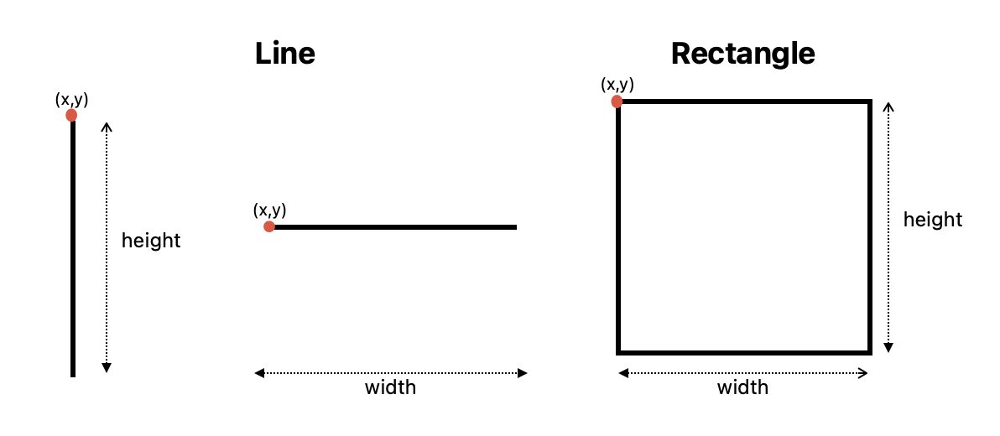
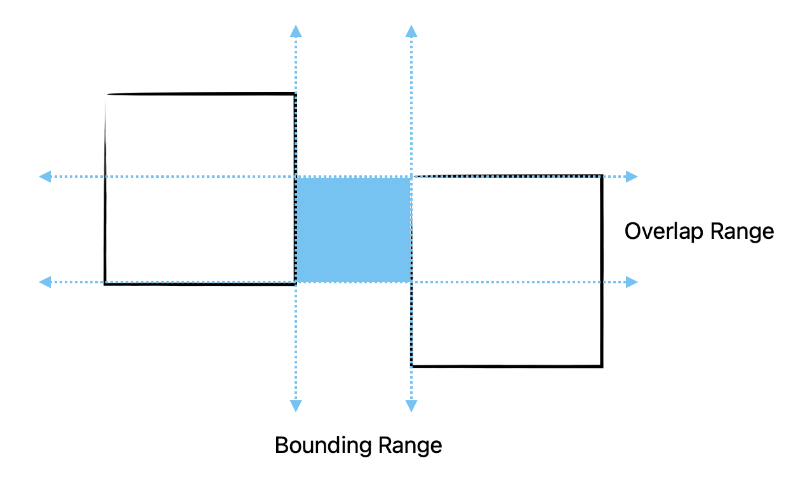
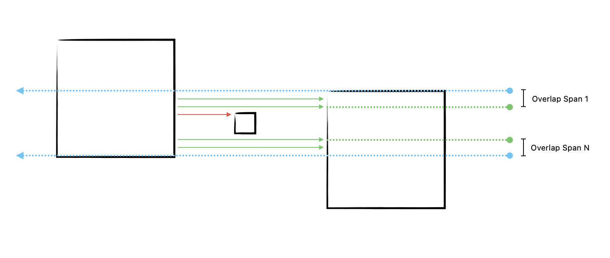
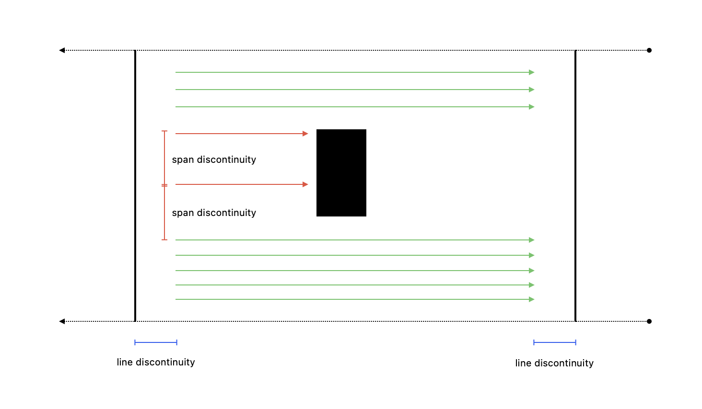
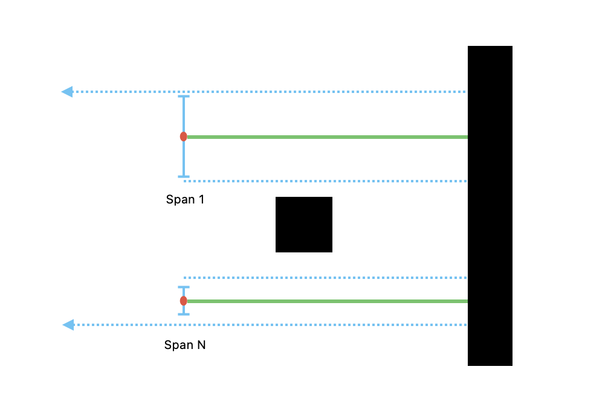
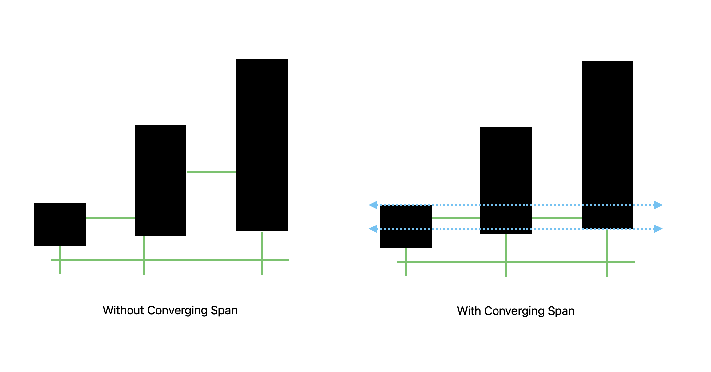

# Image-Based Layout Modeling and Pathfinding

## Overview

This project aims to convert real-life maps, layouts, or floor plans into computer-understandable models for various
applications, such as shortest path finding. A key application is to use scaled maps of warehouse interiors to model
warehouse shelves and optimize navigation for store personnel.

## Features

- **Image Processing**: Enhance contrast, apply Gaussian blur, adaptive thresholding, and upscaling.
- **Rectangle Detection**: Detect and filter rectangles representing shelves or obstacles.
- **Clustering**: Cluster detected rectangles by size or distance using KMeans.
- **Edge Connection**: Create connection lines between non-intersecting rectangles.

## Installation

### Prerequisites

- Python 3.7 or higher

### Steps

1. **Clone the repository:**
   ```bash
   git clone git@github.com:akgunfu/layroad.git
   cd layroad
   ```

2. **Run the installation script:**
   ```bash
   ./install.sh
   ```

## Usage

### Command-Line Interface

The main script, `main.py`, can be run from the command line to process images:

```bash
python main.py -i <input_directory> -o <output_directory> -m <max_images> -f <file_path>
```

#### Arguments

| Argument           | Description                                | Default   |
|--------------------|--------------------------------------------|-----------|
| `-i, --input_dir`  | Directory containing input images          | `assets`  |
| `-o, --output_dir` | Directory to save output images and shapes | `outputs` |
| `-m, --max_images` | Maximum number of images to process        | `3`       |
| `-f, --file_path`  | Path to the input image file               | `None`    |

### Example

Bare usage

```bash
python main.py
```

To process images from the `assets` directory and save the results to the `outputs` directory:

```bash
python main.py -i assets -o outputs -m 3
```

### Server Interface

The server script, `server.py`, allows for uploading and processing files via a web interface.

1. **Run the Server:**
   ```bash
   python server.py
   ```

2. **Upload a File:**
   Use `curl` or Postman to upload a file to the server.

   **Using `curl`:**
   ```bash
   curl -F "file=@/path/to/your/file.pdf" http://127.0.0.1:5000/process
   ```

#### Server Endpoints

| Endpoint   | Method | Description               |
|------------|--------|---------------------------|
| `/process` | POST   | Upload and process a file |

## Troubleshooting

### Common Issues

1. **Missing Dependencies**:
    - Ensure all required Python packages are installed by running `./install.sh`.

2. **File Not Found**:
    - Ensure the input directory or file path specified exists and contains the correct images.

3. **Permission Errors**:
    - Ensure you have the necessary permissions to read from the input directory and write to the output directory.

4. **Invalid Image Formats**:
    - Ensure the images are in supported formats (PNG, JPG, JPEG, PDF).

### Sample Errors and Solutions

1. **Error: `OSError: poppler not found`**
    - Solution: Install `poppler` on your system:
      ```bash
      brew install poppler
      ```

2. **Error: `FileNotFoundError: Image not found`**
    - Solution: Ensure the image file paths are correct and the files exist in the specified directory.

## Documentation (In Progress)

### Rectangle Detection

### Line Detection







